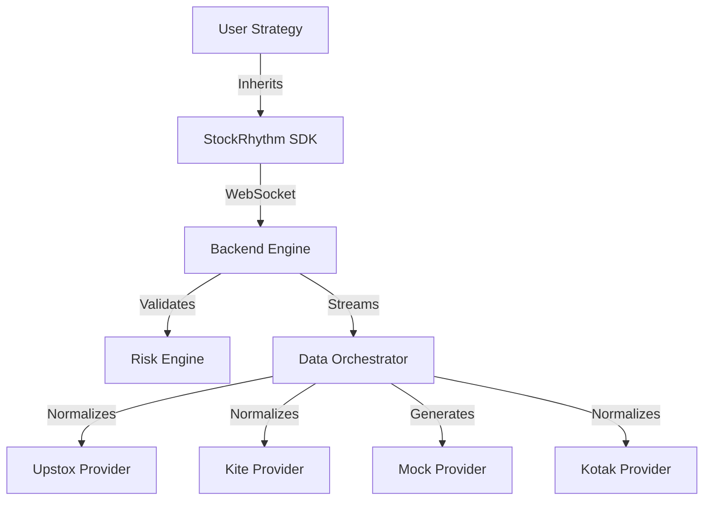

# StockRhythm: Development & Architecture Guide

This document serves as the internal knowledge base for developing, maintaining, and extending the **StockRhythm** platform. It details the architectural decisions, component interactions, and specific workflows for contributors.

## 1. Project Philosophy & Architecture

StockRhythm follows a strict layered architecture to ensure modularity and ease of development.

### The 4-Layer Platform Architecture
1.  **Broker Layer (External)**: The raw APIs (Kotak, Upstox, Kite). Handles order execution and raw data streaming.
2.  **Backend Layer (OS)**: The central trading engine (`apps/backend`). Handles data normalization, auth lifecycles (TOTP/MPIN), and pre-trade risk management.
3.  **SDK Layer (Gateway)**: The Python library (`stockrhythm-sdk`). Provides type-safe Pydantic models and the base `Strategy` class. Abstract away all networking and JSON parsing.
4.  **Strategy Layer (Brain)**: User-defined bots (`strategies/`). Focuses purely on trading logic using normalized data provided by the SDK.

### Core Principles
*   **Developer-Centric:** The SDK (`stockrhythm-sdk`) is the "language" of the platform. It must remain lightweight and intuitive.
*   **Hard Guardrails:** The Backend acts as the operating system, enforcing risk checks (Buying Power, Max Order Size) *before* any order reaches an exchange.
*   **Data Abstraction:** Strategies should never know *which* provider (Upstox, Kite, Mock) is streaming data. They only consume normalized `Tick` objects.

### High-Level Architecture


## 2. Project Structure

```text
stockrhythm/
├── apps/
│   ├── backend/          # Trading Engine
│   ├── mock_exchange/    # Simulator
│   └── dashboard/        # UI
├── packages/
│   ├── stockrhythm-sdk/  # Client Library
│   └── stockrhythm-cli/  # Scaffolding Tool
├── strategies/           # User Bots (Standard location)
├── tests/                # Verification Suite
└── .env                  # Environment Config
```

## 3. Directory Structure & Components

The project uses a standard `src` layout for all packages to prevent import ambiguities.

### A. The Workspace (`/`)
*   **`pyproject.toml`**: The root configuration. Defines the `uv` workspace, linking `apps/*` and `packages/*`.
*   **`docker-compose.yml`**: Orchestrates local infrastructure (Redis, QuestDB, Backend).

### B. The SDK (`packages/stockrhythm-sdk`)
*   **Role**: The purely Python runtime library imported by users.
*   **Key Files**:
    *   `src/stockrhythm/models.py`: **THE CONTRACT**. Shared Pydantic models (`Tick`, `Order`) that define the data shape between Backend and SDK.
    *   `src/stockrhythm/strategy.py`: The `Strategy` abstract base class. Manages the asyncio event loop and `on_tick` callbacks.
    *   `src/stockrhythm/client.py`: Handles WebSocket communication with the Backend.

### C. The CLI (`packages/stockrhythm-cli`)
*   **Role**: The command-line interface for project scaffolding and management.
*   **Key Files**:
    *   `src/stockrhythm_cli/commands/init.py`: Generates new strategy folders with boilerplate code (`strategy.py`, `requirements.txt`).
    *   `src/stockrhythm_cli/main.py`: Entry point using `Typer`.

### D. The Backend (`apps/backend`)
*   **Role**: The central execution engine.
*   **Key Files**:
    *   `src/main.py`: FastAPI entry point handling WebSocket connections.
    *   `src/data_orchestrator.py`: Factory pattern to initialize the correct `MarketDataProvider` based on `config.yaml`.
    *   `src/risk_engine.py`: Validates `Order` objects against account state.
    *   `src/providers/`: The Data Abstraction Layer.
        *   `base.py`: `MarketDataProvider` interface.
        *   `upstox.py`, `mock.py`: Concrete implementations.

## 3. Development Workflow

### Prerequisite
Ensure `uv` is installed:
```bash
curl -LsSf https://astral.sh/uv/install.sh | sh
```

### ⚠️ AGENT INSTRUCTION: ENVIRONMENT VARIABLES
**DO NOT TOUCH, MODIFY, OR READ THE `.env` FILE DIRECTLY.** 
All sensitive credentials (API Keys, TOTP Secrets, etc.) are managed manually by the user. Agents should only provide placeholders or instructions on which variables need to be set.

### Dependency Management (IMPORTANT)
**Do not use `pip` directly.** This project uses `uv` workspaces.
*   **Install/Sync**: Run `uv sync` at the root to install all dependencies for all packages.
*   **Add Dependency**: `uv add <package> --package backend` (or edit the specific `pyproject.toml` and run `uv sync`).

### Setup ("The Golden Path")
1.  **Sync Dependencies**:
    ```bash
    uv sync
    ```
    This installs all dependencies for all packages in a virtual environment.

2.  **Start Infrastructure**:
    ```bash
    docker-compose up -d backend redis
    ```

### Testing
*   **Unit Tests**: Located in `tests/unit`. Focus on `risk_engine.py` logic.
*   **Integration Tests**: Located in `tests/integration`.
    1.  Set `active_provider: "mock"` in `apps/backend/config.yaml`.
    2.  Run a test bot using the SDK against the running Backend.

## 4. Extending the Platform

### Adding a New Broker (e.g., Kite)
1.  **Create Provider**: Add `apps/backend/src/providers/kite.py`.
2.  **Implement Interface**: Inherit from `MarketDataProvider` (`base.py`).
    *   Implement `connect()`: Handle authentication.
    *   Implement `stream()`: Connect to vendor WebSocket, read JSON, and **yield normalized `Tick` objects**.
3.  **Register**: Update `apps/backend/src/data_orchestrator.py` to handle the "kite" key in configuration.

### Modifying the Contract
If you change `Tick` or `Order` in `packages/stockrhythm-sdk/src/stockrhythm/models.py`:
1.  **Version Bump**: Increment version in `pyproject.toml`.
2.  **Re-sync**: Run `uv sync` to ensure the Backend picks up the changed models (since it depends on the local SDK version).

## 5. Deployment Concepts
*   **Local**: Strategies run in a local python process connecting to `localhost:8000`.
*   **Cloud (Future)**: `stockrhythm deploy` will zip the strategy, upload it to an S3 bucket, and trigger a Kubernetes job that runs the strategy container alongside a sidecar Backend proxy.
